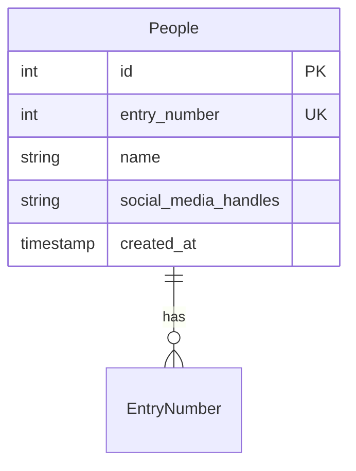

# Data Layer Analysis: Person Tracking List for Radio Show

## Executive Summary

This document provides a comprehensive data layer analysis for the Person Tracking List application. The system is designed to maintain and display a list of people mentioned during a radio show, allowing fans to search, sort, and view details about each person. The data model is intentionally simple, consisting of a single core entity (`people`) with minimal relationships, optimized for read-heavy operations and scalability up to approximately 100 entries.

**Key Data Requirements:**

- Store person information (name, entry number, social media handles, timestamp)
- Support search and filtering by name
- Enable sorting by entry number, name, and date added
- Display detail views with full person information
- Maintain historical entry numbering (preserve numbers even if entries are removed)

**Expected Data Volume:** ~100 entries with minimal growth

**Primary Operations:** Read operations (fetch, search, sort) are the dominant pattern with infrequent writes

## Table of Contents

1. [Requirements Analysis](#requirements-analysis)
2. [Data Entity Analysis](#data-entity-analysis)
3. [Data Model Design](#data-model-design)
4. [Data Flow Analysis](#data-flow-analysis)
5. [Data Validation & Quality](#data-validation--quality)
6. [Security & Privacy](#security--privacy)
7. [Performance & Scalability](#performance--scalability)
8. [Implementation Specifications](#implementation-specifications)
9. [API Specifications](#api-specifications)

## Requirements Analysis

### Functional Requirements Analysis

#### Data Input Requirements

The system needs to capture and store the following data:

- **Person Name**: Full name of the person (text, required)
- **Entry Number**: Unique sequential number representing order of addition (integer, unique, required)
- **Social Media Handles**: Optional handles for various platforms (flexible format, optional)
- **Created Timestamp**: When the person was added to the system (timestamp, required)

#### Data Output Requirements

The system needs to retrieve and display:

- Complete list of all people with their entry numbers and names
- Search/filter results based on name queries
- Sorted lists by:
  - Entry number (ascending/descending)
  - Name (alphabetical A-Z / Z-A)
  - Date added (most recent first / oldest first)
- Detail view information including all person fields

#### Data Processing Requirements

- Real-time search filtering on client-side (after initial data fetch)
- Sorting operations on client-side (after initial data fetch)
- Case-insensitive name matching for search
- Secondary sort by date when names are identical

#### Data Integration Requirements

- No external data sources (self-contained)
- API endpoint for data retrieval (GET /api/people)
- Direct database access for admin operations (outside application)

#### Data Reporting Requirements

- No analytics or reporting requirements initially
- Public read-only access to all data

### Non-Functional Requirements Analysis

#### Performance Requirements

- **Data Volume**: ~100 entries maximum
- **Response Time**: Load within 2 seconds on typical internet connection
- **Throughput**: Minimal concurrent access expected
- **Concurrency**: Low concurrent user expectations (radio show fans)
- **Resource Utilization**: Minimal server resources required

#### Scalability Requirements

- **Data Growth**: Fixed at ~100 entries (bounded scope)
- **User Growth**: Radio show fan base
- **Geographic Distribution**: Single region deployment sufficient
- **Load Distribution**: No sharding needed
- **Capacity Planning**: Single database instance sufficient

#### Security Requirements

- **Access Control**: Public read access only
- **Data Protection**: No sensitive personal information (names and social handles are public data)
- **Encryption**: HTTPS for data in transit
- **Backup**: Regular backups recommended for data preservation

#### Availability Requirements

- **Uptime**: No critical uptime requirements (complementary asset)
- **Disaster Recovery**: Basic backup and restore procedures
- **Data Retention**: Indefinite retention of historical entries

#### Data Quality Requirements

- **Accuracy**: Entry numbers must be unique and sequential
- **Completeness**: Name field is required, all other fields optional
- **Consistency**: Entry numbers preserved even if entries deleted
- **Validity**: Names should be human-readable text
- **Uniqueness**: No duplicate names required (multiple people can have same name)

### Business Rules Extraction

#### Data Validation Rules

1. **Entry Number**: Must be unique, positive integer
2. **Name**: Required field, cannot be empty or null, max 255 characters
3. **Social Media Handles**: Optional, can be JSON, plain text, or structured format
4. **Created At**: Automatically set on record creation, cannot be modified

#### Workflow Rules

1. **Entry Number Assignment**: New entries receive the next sequential number (not reused even if entries deleted)
2. **Data Modification**: Updates allowed only through admin interface (outside application scope)
3. **Deletion**: Soft delete consideration (not in initial scope, but entry numbers preserved)

#### Access Control Rules

1. **Read Access**: Public read access to all data
2. **Write Access**: Admin-only through external tools
3. **No Authentication**: No user authentication required

#### Data Retention Rules

1. **Retention Period**: Indefinite
2. **Archive Strategy**: No archiving required
3. **Historical Data**: All historical entries maintained

#### Compliance Rules

1. **GDPR**: Not applicable (public information, no PII beyond names)
2. **Data Privacy**: No sensitive personal information collected
3. **Content Policy**: Social media handles are display-only, not validated

## Data Entity Analysis

### Entity Discovery

#### Core Business Entities

**People** (Primary Entity)

- Purpose: Stores information about people mentioned during the radio show
- Cardinality: One record per person
- Relationships: None (standalone entity)

#### Supporting Entities

None required for initial implementation. The system is intentionally simple with a single entity.

#### Reference Entities

None required for initial implementation.

#### Audit Entities

None required for initial implementation. Basic `created_at` timestamp is maintained in the primary entity.

#### Integration Entities

None required.

### Attribute Analysis

#### People Entity Attributes

**Primary Attributes** (Essential characteristics):

- `id`: Unique identifier for database operations (primary key, auto-increment)
- `entry_number`: Display number representing order of addition (unique, required)
- `name`: Full name of the person (required, indexed for search)
- `created_at`: Timestamp of record creation (required, indexed for sorting)

**Optional Attributes** (Non-essential characteristics):

- `social_media_handles`: Social media profile information (optional, flexible format)

**Audit Attributes** (Tracking fields):

- `created_at`: Timestamp of creation (captured automatically)

**System Attributes** (Technical fields):

- `id`: Primary key for referential integrity (auto-generated)

### Relationship Analysis

**No relationships** - The People entity is standalone. The data model is intentionally simple with no foreign key relationships, enabling:

- Simple query patterns
- Easy data migration
- Minimal complexity
- Optimal read performance

## Data Model Design

### Conceptual Data Model



**Business Concept Map:**

- **People**: Individuals mentioned during radio show
- **Entry Number**: Sequential order number (preserved even if entry deleted)
- **Social Media Handles**: Optional contact/social information
- **Name**: Identity identifier for the person

**Scope Definition:**

- **Included**: Basic person information (name, entry number, social handles, timestamp)
- **Excluded**: User profiles, comments, ratings, images, detailed profiles, categories

**Assumptions and Constraints:**

1. Maximum 100 entries total
2. Entry numbers never reused (even if entry deleted)
3. Names are not required to be unique
4. Social media handles are display-only (not validated)
5. No complex queries or joins required
6. Read-heavy workload (writes infrequent)

### Logical Data Model

**Normalized Entity Structure:**

People Table (3NF Normalized):

```
People (
    id: INTEGER (Primary Key, Auto-increment)
    entry_number: INTEGER (Unique, Not Null)
    name: VARCHAR(255) (Not Null)
    social_media_handles: TEXT (Nullable)
    created_at: TIMESTAMP (Not Null, Default: CURRENT_TIMESTAMP)
)
```

**Relationship Cardinality:**

- None (standalone entity)

**Attribute Definitions:**

| Attribute            | Type         | Constraints                         | Description                            |
| -------------------- | ------------ | ----------------------------------- | -------------------------------------- |
| id                   | INTEGER      | PK, AUTO_INCREMENT                  | Primary key, unique identifier         |
| entry_number         | INTEGER      | UNIQUE, NOT NULL                    | Display number, preserved on deletion  |
| name                 | VARCHAR(255) | NOT NULL                            | Person's full name, indexed for search |
| social_media_handles | TEXT         | NULLABLE                            | Optional social media information      |
| created_at           | TIMESTAMP    | NOT NULL, DEFAULT CURRENT_TIMESTAMP | Record creation timestamp              |

**Business Rules:**

1. `entry_number` must be unique across all records
2. `name` cannot be null or empty
3. `entry_number` cannot be null or negative
4. `created_at` automatically set on insert, never modified
5. Entry numbers are never reused (business rule enforced in application logic)

**Data Types and Domains:**

| Column               | Data Type    | Justification                                             |
| -------------------- | ------------ | --------------------------------------------------------- |
| id                   | INTEGER      | Efficient primary key, sufficient for 100 records         |
| entry_number         | INTEGER      | Represents sequential order                               |
| name                 | VARCHAR(255) | Sufficient for full names, avoids TEXT overhead for index |
| social_media_handles | TEXT         | Flexible length for various handle formats                |
| created_at           | TIMESTAMP    | PostgreSQL timestamp with timezone                        |

### Physical Data Model

**Database Schema:**

```sql
-- People table
CREATE TABLE people (
    id SERIAL PRIMARY KEY,
    entry_number INTEGER NOT NULL UNIQUE,
    name VARCHAR(255) NOT NULL,
    social_media_handles TEXT,
    created_at TIMESTAMP NOT NULL DEFAULT CURRENT_TIMESTAMP
);

-- Indexes for performance
CREATE INDEX idx_people_entry_number ON people(entry_number);
CREATE INDEX idx_people_name ON people(name);
CREATE INDEX idx_people_created_at ON people(created_at);

-- Composite index for common query patterns
CREATE INDEX idx_people_name_lower ON people(LOWER(name));
```

**Indexing Strategy:**

| Index            | Columns      | Purpose                 | Query Pattern           |
| ---------------- | ------------ | ----------------------- | ----------------------- |
| Primary Key      | id           | Uniqueness              | Lookup by ID            |
| Unique Index     | entry_number | Display order           | Sort by entry number    |
| B-Tree Index     | name         | Name search             | Case-insensitive search |
| B-Tree Index     | created_at   | Date sorting            | Sort by date added      |
| Expression Index | LOWER(name)  | Case-insensitive search | Search optimization     |

**Performance Optimization Notes:**

- All frequently queried columns have indexes
- Expression index on `LOWER(name)` optimizes case-insensitive search
- Composite indexes not needed (no multi-column WHERE clauses)
- Index overhead minimal for 100 records

**Partitioning Strategy:**

- Not required (only 100 records)

**Storage Considerations:**

- Estimated row size: ~200 bytes average
- Total table size: ~20KB (negligible)
- No storage optimization needed

## Data Flow Analysis

### Data Movement Mapping

**Data Sources:**

1. **Admin Input**: People added via admin interface (outside application)
2. **Database**: PostgreSQL stores all person records

**Data Sinks:**

1. **Web Frontend**: Next.js application displays list to users
2. **API Responses**: JSON responses sent to frontend
3. **Search Results**: Filtered lists based on user queries
4. **Detail Views**: Individual person information

**Data Transformations:**

1. **Database → API**: SQL result sets converted to JSON
2. **Client-side Filtering**: Full dataset filtered by search term (case-insensitive)
3. **Client-side Sorting**: Full dataset sorted by selected criteria
4. **Display Formatting**: Raw data formatted for UI display

**Data Storage:**

- **Location**: PostgreSQL database
- **Retention**: Indefinite
- **Backup**: Regular automated backups

**Data Distribution:**

```
Admin → PostgreSQL → API → Next.js Client → User Browser
```

### Integration Points

**Internal API Integration:**

- **Endpoint**: GET /api/people
- **Method**: GET
- **Authentication**: None
- **Response**: JSON array of person objects

**Data Import/Export:**

- Import: Via admin tools or direct database access
- Export: Via API endpoint (JSON format)
- No batch processing required

**Real-time Synchronization:**

- Not required (semi-regular updates only)
- Cache TTL acceptable
- No WebSocket or polling needed

**Backup and Recovery:**

- Automated daily backups recommended
- Point-in-time recovery capability
- Backup retention: 30 days minimum

## Data Validation & Quality

### Data Quality Dimensions

**Accuracy:**

- Entry numbers must be correct and sequential
- Names must accurately represent actual people
- Social media handles must be valid (display-only, not validated)

**Completeness:**

- Name field required (100% completeness)
- Entry number required (100% completeness)
- Social media handles optional (0-100% completeness acceptable)
- Created_at automatically populated (100% completeness)

**Consistency:**

- Entry numbers unique across all records
- Date formats consistent (ISO 8601)
- Name format consistent (no leading/trailing whitespace)

**Timeliness:**

- Created_at reflects actual creation time
- Data updated semi-regularly during radio show

**Validity:**

- Entry numbers positive integers
- Names non-empty strings
- Created_at valid timestamps

**Uniqueness:**

- Entry numbers must be unique (enforced by database)
- Names not required to be unique (multiple people can share names)

### Validation Rules Design

**Format Validation:**

1. **Name**: Non-empty string, max 255 characters, trim whitespace
2. **Entry Number**: Positive integer, unique value
3. **Social Media Handles**: Text field, no format validation
4. **Created At**: Valid timestamp format

**Range Validation:**

1. **Entry Number**: Must be > 0
2. **Name Length**: 1-255 characters

**Business Rule Validation:**

1. Entry numbers never reused (enforced in application logic)
2. Entry numbers sequential but gaps allowed (due to deletions)

**Cross-Field Validation:**
None required (simple entity structure)

**Reference Integrity:**
None required (no foreign keys)

### Data Quality Monitoring

**Quality Metrics:**

1. Number of records with missing names: Target 0%
2. Number of duplicate entry numbers: Target 0%
3. Number of invalid timestamps: Target 0%

**Monitoring Alerts:**

1. Duplicate entry number detected
2. Null or empty name detected
3. Entry number not sequential

**Data Profiling:**

- Count of total records
- Average name length
- Social media handle coverage percentage
- Date range of entries

**Cleansing Procedures:**

1. Trim whitespace from names
2. Remove null or empty records
3. Validate entry number uniqueness

**Quality Reporting:**

- Weekly data quality summary
- Track number of people added per week
- Monitor for data anomalies

## Security & Privacy

### Data Classification

**Public Data:**

- All stored data is public information
- Names: Public information
- Social media handles: Public information
- No sensitive or confidential data

**Personal Data (PII):**

- Names may be considered PII but are voluntarily public
- No contact information stored
- No email addresses or phone numbers
- GDPR not applicable (public data)

### Security Requirements

**Access Control:**

- **Read Access**: Public (unauthenticated)
- **Write Access**: Admin only (external tools)
- **API Security**: Rate limiting recommended
- **No Authentication**: Not required for initial version

**Data Encryption:**

- **In Transit**: HTTPS/TLS required
- **At Rest**: Database encryption recommended
- **Backup Encryption**: Encrypted backups

**Audit Logging:**

- Not required for initial version
- Consider basic access logs
- No sensitive operations to audit

**Data Masking:**

- Not required (public data)
- Not applicable to non-production environments

**Compliance:**

- **GDPR**: Not applicable (public information)
- **CCPA**: Not applicable (no personal information)
- **Other Regulations**: None identified

### Security Best Practices

1. Input validation on admin operations (outside application)
2. SQL injection prevention (use parameterized queries)
3. HTTPS enforcement
4. Rate limiting on API endpoints
5. Regular security updates for dependencies

## Performance & Scalability

### Performance Requirements

**Response Time Targets:**

- API response time: < 200ms for full dataset (100 records)
- Page load time: < 2 seconds total
- Search response time: Instant (client-side filtering)
- Sort response time: Instant (client-side sorting)

**Throughput Requirements:**

- Expected: 10-50 requests per minute
- Peak: 200 requests per minute (during radio show)
- Well within typical server capabilities

**Concurrency Requirements:**

- Expected concurrent users: 10-50
- Peak concurrent users: 100
- Read-only operations (no locking concerns)

**Resource Utilization:**

- CPU: Minimal (simple queries)
- Memory: Minimal (small dataset)
- Storage: < 1MB total
- Network: Minimal bandwidth

**Bottleneck Analysis:**

1. No identified bottlenecks (very small dataset)
2. Client-side filtering/sorting (no server load)
3. Single database query per page load
4. No complex joins or aggregations

### Scalability Planning

**Data Volume Growth:**

- Fixed at ~100 entries (no growth expected)
- Current design handles 1000+ entries without issues
- No scaling concerns

**User Growth:**

- Radio show audience determines user base
- No expected scaling issues
- Read-only pattern scales easily

**Geographic Distribution:**

- Single region deployment
- No CDN required
- No multi-region considerations

**Load Distribution:**

- Single server sufficient
- No load balancing needed
- Database on same server or adjacent

**Capacity Planning:**

- Current infrastructure: Basic VPS sufficient
- Future needs: None expected
- Cost: Minimal infrastructure costs

### Performance Optimization Strategies

1. **Query Optimization**:

   - Index all frequently queried columns
   - Single query returns all data
   - Expression index for case-insensitive search

2. **Caching Strategy**:

   - Consider Redis caching (optional, likely unnecessary)
   - Client-side caching acceptable
   - Cache TTL: 5-10 minutes

3. **Frontend Optimization**:

   - Client-side filtering and sorting
   - Lazy loading not needed (small dataset)
   - Minimal JavaScript bundle size

4. **Network Optimization**:
   - Gzip compression on responses
   - HTTP/2 support
   - Keep-alive connections

## Implementation Specifications

### Database Design Specifications

**Table Definition:**

```sql
-- Create people table
CREATE TABLE people (
    id SERIAL PRIMARY KEY,
    entry_number INTEGER NOT NULL UNIQUE,
    name VARCHAR(255) NOT NULL,
    social_media_handles TEXT,
    created_at TIMESTAMP NOT NULL DEFAULT CURRENT_TIMESTAMP
);

-- Add indexes for performance
CREATE INDEX idx_people_entry_number ON people(entry_number);
CREATE INDEX idx_people_name ON people(name);
CREATE INDEX idx_people_created_at ON people(created_at);

-- Expression index for case-insensitive search
CREATE INDEX idx_people_name_lower ON people(LOWER(name));

-- Add constraints
ALTER TABLE people
    ADD CONSTRAINT chk_entry_number_positive
    CHECK (entry_number > 0);

ALTER TABLE people
    ADD CONSTRAINT chk_name_not_empty
    CHECK (name != '' AND name IS NOT NULL);

-- Add comments
COMMENT ON TABLE people IS 'Stores information about people mentioned during radio show';
COMMENT ON COLUMN people.id IS 'Primary key, auto-incremented';
COMMENT ON COLUMN people.entry_number IS 'Display number representing order of addition, never reused';
COMMENT ON COLUMN people.name IS 'Full name of the person';
COMMENT ON COLUMN people.social_media_handles IS 'Optional social media information';
COMMENT ON COLUMN people.created_at IS 'Timestamp when record was created';
```

**Sample Data:**

```sql
-- Insert sample data
INSERT INTO people (entry_number, name, social_media_handles, created_at) VALUES
(1, 'Santos Flores', '@santosflores', '2024-01-15 10:00:00'),
(2, 'Juan Perez', '@juanperez', '2024-01-22 14:30:00'),
(3, 'John Doe', '@johndoe', '2024-02-01 09:15:00');
```

**Migration Scripts:**

```sql
-- Migration: 001_create_people_table.sql
-- Description: Create the initial people table
-- Date: 2024-01-01
-- Rollback: DROP TABLE IF EXISTS people;

CREATE TABLE people (
    id SERIAL PRIMARY KEY,
    entry_number INTEGER NOT NULL UNIQUE,
    name VARCHAR(255) NOT NULL,
    social_media_handles TEXT,
    created_at TIMESTAMP NOT NULL DEFAULT CURRENT_TIMESTAMP
);

CREATE INDEX idx_people_entry_number ON people(entry_number);
CREATE INDEX idx_people_name ON people(name);
CREATE INDEX idx_people_created_at ON people(created_at);
CREATE INDEX idx_people_name_lower ON people(LOWER(name));

ALTER TABLE people
    ADD CONSTRAINT chk_entry_number_positive
    CHECK (entry_number > 0);

ALTER TABLE people
    ADD CONSTRAINT chk_name_not_empty
    CHECK (name != '' AND name IS NOT NULL);
```

### Query Specifications

**Primary Queries:**

```sql
-- Query 1: Get all people (sorted by entry number)
SELECT
    id,
    entry_number,
    name,
    social_media_handles,
    created_at
FROM people
ORDER BY entry_number ASC;

-- Query 2: Search by name (case-insensitive)
SELECT
    id,
    entry_number,
    name,
    social_media_handles,
    created_at
FROM people
WHERE LOWER(name) LIKE LOWER($1)
ORDER BY entry_number ASC;

-- Query 3: Get single person by ID
SELECT
    id,
    entry_number,
    name,
    social_media_handles,
    created_at
FROM people
WHERE id = $1;

-- Query 4: Get next entry number
SELECT COALESCE(MAX(entry_number), 0) + 1 AS next_entry_number
FROM people;
```

### Data Access Layer Specifications

**Repository Pattern:**

```typescript
// types/person.ts
export interface Person {
  id: number;
  entry_number: number;
  name: string;
  social_media_handles: string | null;
  created_at: string;
}

// lib/db.ts
import { Pool } from "pg";
import { Person } from "@/types/person";

const pool = new Pool({
  connectionString: process.env.DATABASE_URL,
});

export async function getAllPeople(): Promise<Person[]> {
  const result = await pool.query<Person>(
    "SELECT id, entry_number, name, social_media_handles, created_at FROM people ORDER BY entry_number ASC"
  );
  return result.rows;
}

export async function getPersonById(id: number): Promise<Person | null> {
  const result = await pool.query<Person>(
    "SELECT id, entry_number, name, social_media_handles, created_at FROM people WHERE id = $1",
    [id]
  );
  return result.rows[0] || null;
}
```

## API Specifications

### API Endpoints

**GET /api/people**

**Purpose:** Retrieve all people from the database.

**Authentication:** None required

**Request:**

```
GET /api/people
Headers:
  Content-Type: application/json
```

**Response:**

```json
{
  "data": [
    {
      "id": 1,
      "entry_number": 1,
      "name": "Santos Flores",
      "social_media_handles": "@santosflores",
      "created_at": "2024-01-15T10:00:00.000Z"
    },
    {
      "id": 2,
      "entry_number": 2,
      "name": "Juan Perez",
      "social_media_handles": "@juanperez",
      "created_at": "2024-01-22T14:30:00.000Z"
    }
  ],
  "count": 2
}
```

**Response Codes:**

- 200 OK: Success
- 500 Internal Server Error: Database error

---

**GET /api/people/[id]**

**Purpose:** Retrieve a single person by ID.

**Authentication:** None required

**Request:**

```
GET /api/people/1
Headers:
  Content-Type: application/json
```

**Response:**

```json
{
  "data": {
    "id": 1,
    "entry_number": 1,
    "name": "Santos Flores",
    "social_media_handles": "@santosflores",
    "created_at": "2024-01-15T10:00:00.000Z"
  }
}
```

**Response Codes:**

- 200 OK: Success
- 404 Not Found: Person not found
- 500 Internal Server Error: Database error

---

### API Implementation Example

**app/api/people/route.ts:**

```typescript
import { NextResponse } from "next/server";
import { getAllPeople } from "@/lib/db";

export async function GET() {
  try {
    const people = await getAllPeople();
    return NextResponse.json({
      data: people,
      count: people.length,
    });
  } catch (error) {
    console.error("Database error:", error);
    return NextResponse.json(
      { error: "Internal server error" },
      { status: 500 }
    );
  }
}
```

**app/api/people/[id]/route.ts:**

```typescript
import { NextResponse } from "next/server";
import { getPersonById } from "@/lib/db";

export async function GET(
  request: Request,
  { params }: { params: { id: string } }
) {
  try {
    const id = parseInt(params.id);
    if (isNaN(id)) {
      return NextResponse.json({ error: "Invalid ID" }, { status: 400 });
    }

    const person = await getPersonById(id);

    if (!person) {
      return NextResponse.json({ error: "Not found" }, { status: 404 });
    }

    return NextResponse.json({ data: person });
  } catch (error) {
    console.error("Database error:", error);
    return NextResponse.json(
      { error: "Internal server error" },
      { status: 500 }
    );
  }
}
```

### Data Transfer Objects (DTOs)

```typescript
// DTOs
export interface PersonDTO {
  id: number;
  entry_number: number;
  name: string;
  social_media_handles: string | null;
  created_at: string;
}

export interface PeopleResponseDTO {
  data: PersonDTO[];
  count: number;
}

export interface PersonResponseDTO {
  data: PersonDTO;
}
```

### Error Handling

**Error Response Format:**

```json
{
  "error": "Error message",
  "code": "ERROR_CODE"
}
```

**Error Codes:**

- `DATABASE_ERROR`: Database operation failed
- `NOT_FOUND`: Resource not found
- `INVALID_ID`: Invalid ID parameter
- `VALIDATION_ERROR`: Request validation failed

## Summary

This data layer analysis provides comprehensive specifications for implementing the Person Tracking List feature. The design is intentionally simple and optimized for the requirements:

**Key Characteristics:**

- Single entity (`people`) with minimal complexity
- No relationships or foreign keys
- Optimized for read-heavy operations
- Scales to ~100 entries without performance concerns
- Public read access with admin-only writes
- Client-side filtering and sorting

**Implementation Ready:**

- Complete database schema with indexes
- SQL migration scripts
- API endpoint specifications
- TypeScript type definitions
- Error handling patterns
- Security considerations

**Next Steps:**

1. Set up PostgreSQL database
2. Run migration scripts
3. Implement API endpoints
4. Connect frontend to API
5. Deploy and test

This design provides a solid foundation that can be extended in the future if requirements change, while remaining simple and performant for the current scope.
